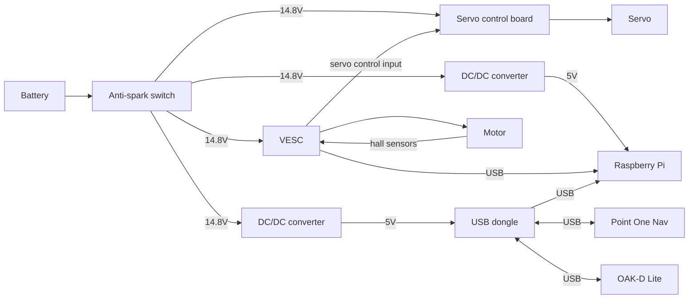
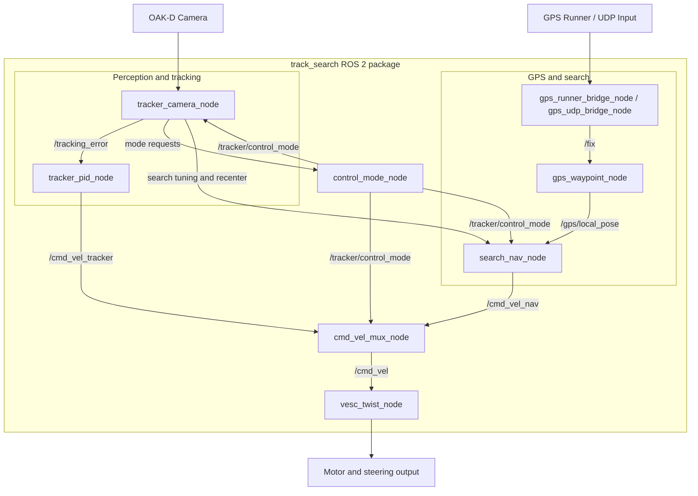

# ECE-MAE_team7_final_project (WORK IN PROGRESS)

### Contributors
 - Alexey Grishakov (ECE)
 - Joshua Yoon (MAE) 
 - Micah Wang (ECE)
 - Nikita Thibault (MAE)


## Overview
This project is a ROS2-based autonomous vehicle system that integrates depth camera, GPS, and VESC sensors to navigate and track objects. It includes a person tracker using DepthAI, a PID controller for VESC motor control, and a search-and-rescue navigation system. The system is designed to operate in a Docker container for portability and reproducibility.

## System architecture


### Wiring diagram




### ROS2 system diagram



## Setup instructions
GPS setup
ROS2 Docker setup
Running Container


## Configuring GPS module

1. Install uv 

```bash
curl -LsSf https://astral.sh/uv/install.sh | sh
```

2. configure permissions:
```bash
sudo adduser $USER dialout
sudo reboot
```

3. Clone gps repo:
```bash

cd ~
git clone https://github.com/UCSD-ECEMAE-148/quectel
cd ~/quectel
uv init
uv add -r p1_runner/requirements.txt
uv add pyserial fusion_engine_client pynmea ntripstreams websockets
echo "3.10" >> .python-version
cd
```

4. Reset and configure the gps module:
```bash
uv run --directory ~/quectel ~/quectel/p1_runner/bin/config_tool.py reset factory
uv run --directory ~/quectel ~/quectel/p1_runner/bin/config_tool.py apply uart2_message_rate nmea gga on
uv run --directory ~/quectel ~/quectel/p1_runner/bin/config_tool.py save
```

5. Verify that everything works
```bash
uv run --directory ~/quectel ~/quectel/p1_runner/bin/runner.py --device-id <YOUR_USERNAME> --polaris <YOUR_PASSWORD> --device-port /dev/ttyUSB1
```
Should start outputting readings.


## ROS2 Docker setup

Assuming x11 installed and working on RPI and Laptop


```bash
ssh -X -Y user@rpihostname
```

Fix X11 permissions
```bash
xhost +local:root
```

set udev rules:
```bash
echo 'SUBSYSTEM=="usb", ATTRS{idVendor}=="03e7", MODE="0666"' | sudo tee /etc/udev/rules.d/80-movidius.rules
sudo udevadm control --reload-rules && sudo udevadm trigger
```

pull docker container:
```bash
docker pull algrish2/ros2-kilted:ver-2-with-final-proj
```

proper docker command:
```bash
docker run \
    --name ros2 \
    -it \
    --privileged \
    --net=host \
    -e DISPLAY=$DISPLAY \
    --volume /dev/bus/usb:/dev/bus/usb \
    --device-cgroup-rule='c 189:* rmw' \
    --device /dev/video0 \
    --volume="$HOME/.Xauthority:/root/.Xauthority:rw" \
    --volume /etc/passwd:/etc/passwd:ro \
    --volume /etc/group:/etc/group:ro \
    algrish2/ros2-kilted:ver-2-with-final-proj
```


install uv 

```bash
curl -LsSf https://astral.sh/uv/install.sh | sh
```

clone repo into src:

```bash
cd /home/projects/ros2_ws/src
git clone https://github.com/miw069/ECE-MAE_team7_final_project.git
cd ECE-MAE_team7_final_project
mv track_search ../
cd ..
rm -rf ECE-MAE_team7_final_project
```

install proper venv for this project/package.
```bash
cd /home/projects/ros2_ws
uv venv .venv --seed
source .venv/bin/activate
uv add \
  colcon-common-extensions \
  numpy \
  opencv-python \
  PyYAML \
  depthai \
  depthai-nodes \
  lap \
  ultralytics \
  "git+https://github.com/LiamBindle/PyVESC" \
  pyserial
```


Fix the pyvesc package by commenting out lines 41 and 42 in `.venv/lib/python3.12/site-packages/pyvesc/VESC/VESC.py`


```python

        # check firmware version and set GetValue fields to old values if pre version 3.xx
        version = self.get_firmware_version()
        # if int(version.split('.')[0]) < 3:       <- This line
        #    GetValues.fields = pre_v3_33_fields   <- This line
```


To be able to include packages when building:

```bash
source /home/projects/ros2_ws/.venv/bin/activate
```

You can now build any packages you want, and add any packages to your project using the same UV add approach.

## Running project systems

**In a separate terminal run the command below**
*See below how to set up the gps module for this command to work.*
```bash
uv run --directory ~/quectel ~/quectel/p1_runner/bin/runner.py \
  --device-id rQ2gKIc6 \
  --polaris Li48DbiF \
  --device-port /dev/ttyUSB0 \
| stdbuf -oL python3 -c 'import socket,sys; s=socket.socket(socket.AF_INET, socket.SOCK_DGRAM); [s.sendto(line.encode(), ("127.0.0.1", 10110)) for line in sys.stdin if "LLA=" in line]'
```

Now on your main terminal 
(ssh into rpi with x11 support):
```bash
ssh -X -Y user@rpihostname
```
Turn on container:
```bash
xhost +local:root
docker start ros2
docker exec -it ros2 bash
```
In the container:

```bash
cd /home/projects/ros2_ws
source .venv/bin/activate # ensures that the correct build environment is used for packages such as depthai
colcon build --symlink-install && source /opt/ros/$ROS_DISTRO/setup.bash && source /home/projects/ros2_ws/.venv/bin/activate && source /home/projects/ros2_ws/install/setup.bash && ros2 launch track_search track_search.launch.py
```


To start the system after building simply:
```bash
ros2 launch track_search track_search.launch.py
```
